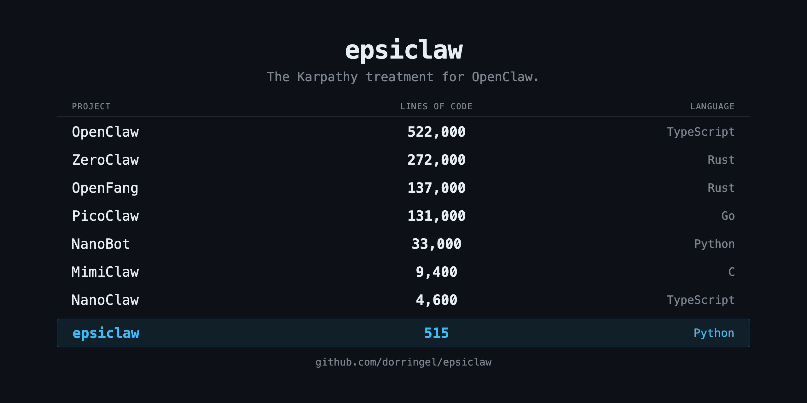
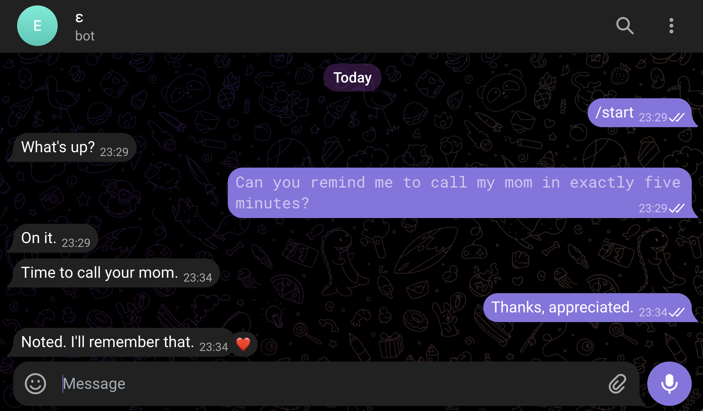

# epsiclaw

The same algorithm that runs inside OpenClaw (522K LOC) - stripped to ε. 515 lines of Python, 6 files, one dependency.



Every week a new claw library appears  - one rewrites it in Rust, another shrinks it to run on a $5 chip, another hardens it for security. Each adds layers that make it harder to see the algorithm underneath. This repo strips it back to the essential loop. Epsilon Claw, an infinitely small OpenClaw. Inspired by Karpathy's [micrograd](https://github.com/karpathy/micrograd), [nanoGPT](https://github.com/karpathy/nanoGPT), [minbpe](https://github.com/karpathy/minbpe), [llm.c](https://github.com/karpathy/llm.c). [Read the full writeup](https://dorringel.github.io/epsiclaw/).



```
$ python agent.py
epsiclaw is running. Accepting chat IDs: {'********'}
[********] user: /start
[********] bot: What's up?
[********] user: Can you remind me to call my mom in exactly five minutes?
[********] tool: get_current_time()
[********] tool: cron_add(description='call my mom', datetime_str='2026-03-25 23:34')
[********] bot: On it.
[********] cron: call my mom
[********] bot: Time to call your mom.
[********] user: Thanks, appreciated.
[********] tool: memory_write(content='The user appreciates reminders and expresses gratitude when helped.')
[********] bot: Noted. I'll remember that.
```

## what's inside

- A **channel** - receives messages, sends replies (`channel.py`, 53 lines)
- A **memory** - markdown files the AI reads and writes (`memory.py`, 65 lines)
- An **agent** - LLM decides, tools execute, repeat (`agent.py` + `llm.py` + `tools.py`, 334 lines)
- A **cron** - fires reminders while you sleep (`cron.py`, 63 lines)

## run it

```bash
git clone https://github.com/dorringel/epsiclaw.git
cd epsiclaw
pip install httpx
cp .env.example .env   # fill in your API keys
python agent.py
```

You need an OpenAI API key and a Telegram bot token ([@BotFather](https://t.me/BotFather)). Optionally, a [Tavily](https://tavily.com) key for web search.

## what this is NOT

- **Not production software.** No auth, no sandboxing, no rate limiting.
- **Not a framework.** No plugins, no middleware, no config files.
- **Not multi-anything.** One user, one model, one channel.

## license

MIT
